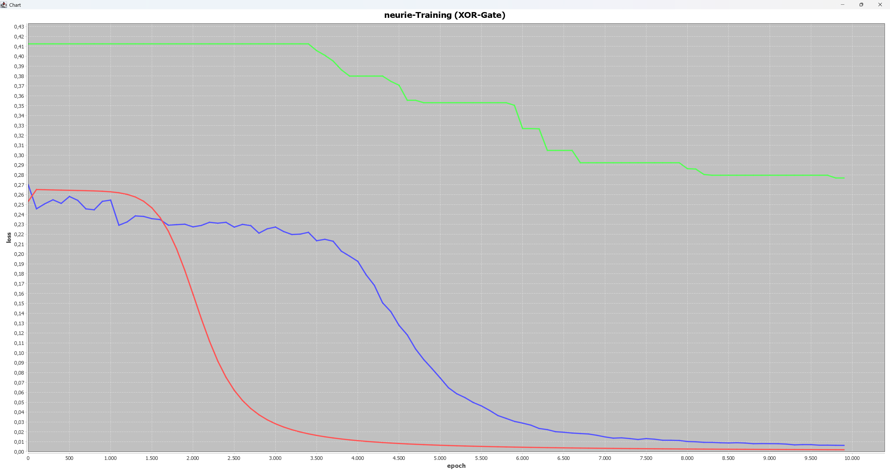

[](https://jitpack.io/#damoebe/neurie) 
[](https://damoebe.github.io/neurie/)
# neurie API
Neurie is a Java framework, which offers you simple and easy to understand neural network architechtures to use in your project. You can train the networks by feeding them dataset in a .json format (see below). Neurie can be trained with two learning techniques: Standart Deep Learning (using Backpropagation) and Evolution-Learning. You can adjust the size of the network, as well as the learing rate and background noise. Moreover neurie network performances can be visually displayed by using the build-in chart-generator class to test archiechure performances. You can also view the [documentation](https://damoebe.github.io/neurie/) of each class used for neurie to understand the math behind the networks and take full advantage of the flexibility of neurie networks. The Evolution Learing is based on an epoch system, which uses target values from the dataset to calculate the networks fittness factor and the deep learning network uses the sigmoid function as an activation function to update neuron activations. Neurie is (for now) only available as a feed-forward architechture (Not Recurrent), which might change in the future. 
## How To Use The API?
Neurie is a Java Maven project, so you will only be able to use neurie in Maven or Gradle. You will need to use the jitpack repository to access the API, because neurie has not been uploaded to maven central. If you are using Maven, paste this repository into your repositories section in the pom.xml:
```
<repository>
    <id>jitpack.io</id>
    <url>https://jitpack.io</url>
</repository>
```
and paste this dependency into your dependencies section:
```
<dependency>
    <groupId>com.github.damoebe</groupId>
    <artifactId>neurie</artifactId>
    <version>v1.1</version>
</dependency>
```
In case you are using Gradle, you will need to paste `maven { url 'https://jitpack.io' }` in in your repositories section in your settings.gradle and `implementation 'com.github.damoebe:neurie:v1.1'` in your dependencies section.\
Reload Maven/Gradle and you will be setup and can now access the Java classes of neurie. Make sure to download the [Java documentation](https://damoebe.github.io/neurie/) to discover the meaning of methods, classes and attributes.
> [!IMPORTANT]
> Please use an JDK 22+ if you are using neurie API, otherwise it won't work.
## Demo 1: Using neurie To Display The Differences Between Network Types
As mentioned above neurie can be trained with various learning methods, that are for the most part fully adjustable. In the following example we will run 3 neurie models having different learning behaviour at the same time. Two of those networks are using deep learning, one with and one without noise, while the third one is getting trained with an Evolution Learning Algorythm. 
### Execution Of Experiment
The chart generated by neurie API (using JFreeChart) will be telling us the correlation between epoch and network loss. All networks get the same basic dataset (XOR dataset, which can be found at me.damoebe.datasets.data) with inputs and targets. In this example we will train them for 10,000 epochs and display a chart point every 100 epochs. The code to execute this experiment would be:
```
Dataset dataset = null;
try {
    dataset = DatasetReader.readJson(System.getProperty("user.dir") +
            "/src/main/java/me/damoebe/datasets/data/xor.json");
} catch (Exception e) {
    throw new RuntimeException(e);
}

Network deep = new DeepNetwork(3, 1, 2, 1, 0.1);
deep.setNoise(0);
Network deep2 = new DeepNetwork(3, 1, 2, 1, 0.05);
deep2.setNoise(0.05);
Network evo = new EvolutionNetwork(3, 1, 2, 1);
evo.setNoise(0.1);


List<Network> networks = new java.util.ArrayList<>(List.of(deep, deep2, evo));
Trainer.train(true, networks, dataset, 10000, 100);
```
Running this code gets us following outputs -> Frame (final state):\

Console Outputs:
```
Epoch 0, Network-Losses: [0.25324427577526426, 0.26995350413112285, 0.4125227300881664]
Epoch 1000, Network-Losses: [0.26284645273064144, 0.25449348899390056, 0.4125227300881664]
Epoch 2000, Network-Losses: [0.15923450667028852, 0.22739252633249335, 0.4125227300881664]
Epoch 3000, Network-Losses: [0.028186892481655748, 0.22720610122404508, 0.4125227300881664]
Epoch 4000, Network-Losses: [0.011115723063815554, 0.1924693374022141, 0.37993852719005744]
Epoch 5000, Network-Losses: [0.006472018373195132, 0.0744869690176295, 0.35299215618620233]
Epoch 6000, Network-Losses: [0.00445858310136996, 0.028853329554006154, 0.32682144072006714]
Epoch 7000, Network-Losses: [0.003363029131897362, 0.01489049089873707, 0.29226032445753825]
Epoch 8000, Network-Losses: [0.0026829698177791962, 0.010249720206532803, 0.2862521709831128]
Epoch 9000, Network-Losses: [0.0022231039087724793, 0.008091609342417498, 0.2796065939796813]
Epoch 9999, Network-Losses: [0.0018932144350063572, 0.006295035911443007, 0.2768472542819349]
```
### Interpretation Of Results
We can clearly see a decreasing loss over the epochs in all three networks. The two deep-learning networks (red🔴 and blue🔵) did the best. They scored a loss of under 0.0 which is optimal, while the evolution learning network (green🟢) had a final loss of 0.3. This result is acceptable considering the slow algorythm behind the evolution learning network.\
Another thing that is noticable in the chart is the geometry of each learning curve. The evolution learning networks loss evolved in a angular sinking 'staircase', this is because the alogorythm of this network only provides the lowest average loss it has ever reached in an epoch and is pratically bruteforcing the neural weights by mutating and resetting in an endless loop. The deep learning network without noise has a much smoother learning curve in contrast to the deep learning network with noise, which visually shows the meaning of the noise factor in neural networks. There are more things we could discover ian the chart alone but it would be too much for this little demo. If you rerun this programm you will see very different results because of the randomness factor in weight initialization.
> [!NOTE]
> There will be more examples in the future if you want to know more about the architechture behind neurie api please visit the [Java documentation](https://damoebe.github.io/neurie/). If you build anything cool with neurie please let me know on discord.


